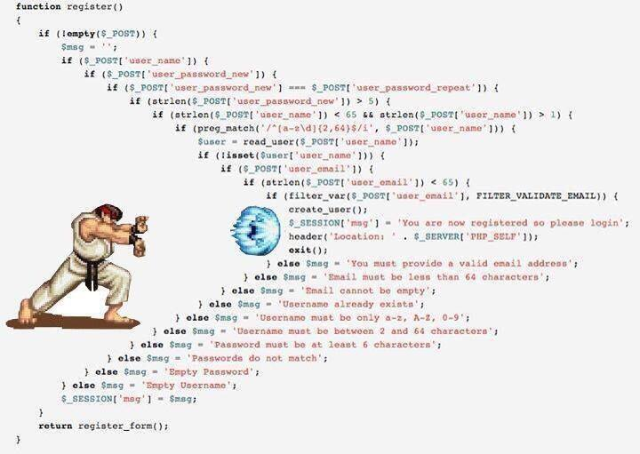

# Boas Práticas de Desenvolvimento de Código em PHP



## Introdução

- Desenvolver código legível e de fácil manutenção é crucial para o sucesso de um projeto em PHP.
- Seguir padrões de codificação estabelecidos, como as PSRs e princípios de Clean Code, ajuda a alcançar esses objetivos.

## [PSR-12](https://www.php-fig.org/psr/psr-12/): Padrão de Código
As recomendações criadas pelo PHP-FIG são agrupadas em PHP Standard Recommendation (PSR). 
Uma PSR basicamente possui recomendações sobre um tema específico, como por exemplo, 
a PSR-12 que fala sobre padronização de sintaxe de código. Cada PSR é identificada por um número e 
possui um status.

- Define um padrão de estilo para a escrita de código PHP.
- Promove a consistência e a legibilidade do código em projetos compartilhados.
- Algumas diretrizes do PSR-12 incluem:
    - Uso de indentação com quatro espaços.
    - Linhas com no máximo 80 caracteres.
    - Uso de chaves em uma nova linha para estruturas de controle.

### Exemplos:

#### Problemas de indentação
```php
<?php
/**
 * Validação de idade da classe Pessoa.
 * */
if ($pessoa->idade >= 0 && $pessoa->idade < 10) {
echo "Criança";
} else {
if ($pessoa->idade >= 10 && $pessoa->idade < 20) {
echo "Adolescente";
} else {
if ($pessoa->idade >= 20 && $pessoa->idade < 30) {
echo "Jovem Adulto";
} else {
if ($pessoa->idade >= 30 && $pessoa->idade < 60) {
echo "Adulto";
} else {
echo "Idoso";
}
}
}
}
```
```php
/**
 * Validação de idade da classe Pessoa.
 * */
if ($pessoa->idade >= 0 && $pessoa->idade < 10) {
    echo "Criança";
} else {
    if ($pessoa->idade >= 10 && $pessoa->idade < 20) {
        echo "Adolescente";
    } else {
        if ($pessoa->idade >= 20 && $pessoa->idade < 30) {
            echo "Jovem Adulto";
        } else {
            if ($pessoa->idade >= 30 && $pessoa->idade < 60) {
                echo "Adulto";
            } else {
                echo "Idoso";
            }
        }
    }
}
```
#### Falta de boas práticas
```php
<?php
namespace Model;
class Pessoa {
private $con;
public $n;
public $i;
public $c;
public $e;
public $t;
public function __construct($con, $n=null, $i=null, $c=null, $e=null, $t=null) {
$this->con=$con;
$this->n=$n;
$this->i=$i;
$this->c=$c;
$this->e=$e;
$this->t=$t;
}
public function validar() {
$e=[];
if(!is_string($this->n)||empty($this->n)) {
$e[]="O nome deve ser uma string não vazia.";
}
if(!is_int($this->i)||$this->i<0) {
$e[]="A idade deve ser um número inteiro positivo.";
}
if(!is_string($this->c)||empty($this->c)) {
$e[]="A cidade deve ser uma string não vazia.";
}
if(!is_string($this->e)||empty($this->e)) {
$e[]="O endereço deve ser uma string não vazia.";
}
if(!is_string($this->t)||empty($this->t)) {
$e[]="O telefone deve ser uma string não vazia.";
}
return $e;
}
public function criar() {
$e=$this->validar();
if(!empty($e)) {
return $e;
}
$q="INSERT INTO pessoas (nome, idade, cidade, endereco, telefone) VALUES (:n, :i, :c, :e, :t)";
$s=$this->con->prepare($q);
$s->bindParam(':n', $this->n);
$s->bindParam(':i', $this->i);
$s->bindParam(':c', $this->c);
$s->bindParam(':e', $this->e);
$s->bindParam(':t', $this->t);
$s->execute();
return "Pessoa criada com sucesso.";
}
public function ler($id) {
$q="SELECT * FROM pessoas WHERE id=:id";
$s=$this->con->prepare($q);
$s->bindParam(':id', $id);
$s->execute();
$d=$s->fetch(PDO::FETCH_ASSOC);
$this->n=$d['nome'];
$this->i=$d['idade'];
$this->c=$d['cidade'];
$this->e=$d['endereco'];
$this->t=$d['telefone'];
return "Dados da pessoa lidos com sucesso.";
}
public function atualizar($id) {
$e=$this->validar();
if(!empty($e)) {
return $e;
}
$q="UPDATE pessoas SET nome=:n, idade=:i, cidade=:c, endereco=:e, telefone=:t WHERE id=:id";
$s=$this->con->prepare($q);
$s->bindParam(':n', $this->n);
$s->bindParam(':i', $this->i);
$s->bindParam(':c', $this->c);
$s->bindParam(':e', $this->e);
$s->bindParam(':t', $this->t);
$s->bindParam(':id', $id);
$s->execute();
return "Dados da pessoa atualizados com sucesso.";
}
public function deletar($id) {
$q="DELETE FROM pessoas WHERE id=:id";
$s=$this->con->prepare($q);
$s->bindParam(':id', $id);
$s->execute();
return "Pessoa deletada com sucesso.";
}
}

```

```php
<?php
/**
* Classe aplicando boas práticas
 */
<?php

namespace Model;

use PDO;
use PDOException;

class Pessoa
{
    private $conexao;
    public $nome;
    public $idade;
    public $cidade;
    public $endereco;
    public $telefone;

    public function __construct()
    {
        $dsn = 'mysql:host=localhost;dbname=seu_banco_de_dados';
        $usuario = 'seu_usuario';
        $senha = 'sua_senha';

        try {
            $this->conexao = new PDO($dsn, $usuario, $senha);
        } catch (PDOException $e) {
            echo 'Erro de conexão: ' . $e->getMessage();
        }
    }

    public function exibirInformacoes()
    {
        echo "Nome: {$this->nome}, Idade: {$this->idade}, Cidade: {$this->cidade}, Endereço: {$this->endereco}, Telefone: {$this->telefone}";
    }

    public function validar()
    {
        $erros = [];
        if (!is_string($this->nome) || empty($this->nome)) {
            $erros[] = "O nome deve ser uma string não vazia.";
        }
        if (!is_int($this->idade) || $this->idade < 0) {
            $erros[] = "A idade deve ser um número inteiro positivo.";
        }
        if (!is_string($this->cidade) || empty($this->cidade)) {
            $erros[] = "A cidade deve ser uma string não vazia.";
        }
        if (!is_string($this->endereco) || empty($this->endereco)) {
            $erros[] = "O endereço deve ser uma string não vazia.";
        }
        if (!is_string($this->telefone) || empty($this->telefone)) {
            $erros[] = "O telefone deve ser uma string não vazia.";
        }
        return $erros;
    }

    public function criar()
    {
        $erros = $this->validar();
        if (!empty($erros)) {
            return $erros;
        }
        $query = "INSERT INTO pessoas (nome, idade, cidade, endereco, telefone) VALUES (:nome, :idade, :cidade, :endereco, :telefone)";
        $stmt = $this->conexao->prepare($query);
        $stmt->bindParam(':nome', $this->nome);
        $stmt->bindParam(':idade', $this->idade);
        $stmt->bindParam(':cidade', $this->cidade);
        $stmt->bindParam(':endereco', $this->endereco);
        $stmt->bindParam(':telefone', $this->telefone);
        $stmt->execute();
        return "Pessoa criada com sucesso.";
    }

    public function ler($id)
    {
        $query = "SELECT * FROM pessoas WHERE id = :id";
        $stmt = $this->conexao->prepare($query);
        $stmt->bindParam(':id', $id);
        $stmt->execute();
        $dados = $stmt->fetch(PDO::FETCH_ASSOC);
        $this->nome = $dados['nome'];
        $this->idade = $dados['idade'];
        $this->cidade = $dados['cidade'];
        $this->endereco = $dados['endereco'];
        $this->telefone = $dados['telefone'];
        return "Dados da pessoa lidos com sucesso.";
    }

    public function atualizar($id)
    {
        $erros = $this->validar();
        if (!empty($erros)) {
            return $erros;
        }
        $query = "UPDATE pessoas SET nome = :nome, idade = :idade, cidade = :cidade, endereco = :endereco, telefone = :telefone WHERE id = :id";
        $stmt = $this->conexao->prepare($query);
        $stmt->bindParam(':nome', $this->nome);
        $stmt->bindParam(':idade', $this->idade);
        $stmt->bindParam(':cidade', $this->cidade);
        $stmt->bindParam(':endereco', $this->endereco);
        $stmt->bindParam(':telefone', $this->telefone);
        $stmt->bindParam(':id', $id);
        $stmt->execute();
        return "Dados da pessoa atualizados com sucesso.";
    }

    public function deletar($id)
    {
        $query = "DELETE FROM pessoas WHERE id = :id";
        $stmt = $this->conexao->prepare($query);
        $stmt->bindParam(':id', $id);
        $stmt->execute();
        return "Pessoa deletada com sucesso.";
    }
}
```

